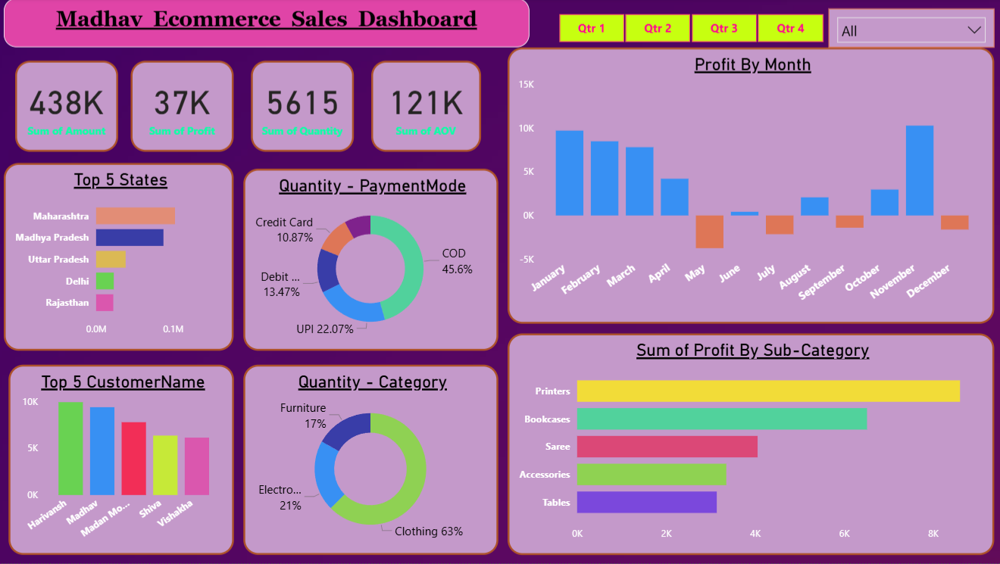

# Power BI Sales Dashboard
## 🖼️ Dashboard Preview

📝 Overview

This Power BI dashboard provides a comprehensive analysis of sales performance across different states. It enables users to gain insights into regional sales trends, revenue distribution, and key performance indicators (KPIs) to support data-driven business decisions.

🎯 Objectives

. Visualize statewise sales performance using interactive maps and charts.

. Identify top-performing and underperforming states.

. Analyze sales trends over time (monthly/quarterly/yearly).

. Track key metrics such as total sales, average sales per state, and sales growth rate.

. Enable users to filter and drill down by state, category, or time period.

📂 Data Sources

(1) Sales Data: Contains transactional-level information such as State, Sales Amount, Date, Category, and Quantity.

(2) Geographical Data: Used for mapping state locations.

(3) Data Type: Imported from Excel/CSV/SQL database (depending on your setup).

🧮 Key Metrics & KPIs

. Total Sales

. Average Sales per State

.Total Quantity Sold

. Sales Growth %

.Top 5 States by Sales

. Top 5 Customer Name by Sales

📈 Visuals Included

.Statewise Sales Map (filled map or choropleth)

.Sales Trend Line Chart (over time)

.Category-wise Sales Bar Chart

.Top States Table

.KPI Cards showing total sales, growth rate, etc.

.Filters/Slicers for year, region, or product category

⚙️ Tools & Technologies

.Power BI Desktop

.Data Source: Excel / CSV / SQL Server / API (specify yours)

.Power Query for data cleaning and transformation

🚀 Features

.Interactive filters for time period, state, and category

.Dynamic tooltips and drill-through pages

.Easy-to-understand visual storytelling

.Custom color themes for readability

📊 Insights Gained

.Identified top-performing states contributing major revenue.

.Found seasonal trends and growth opportunities in low-performing regions.

.Enabled management to focus marketing and supply efforts more effectively.

